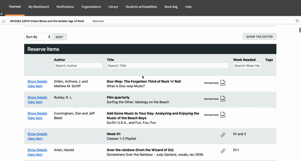

## Urban Houndogs and Phil Spector's Sunglasses

This site is made to improve the MUS264 course experience.

## Problem

Our Blackboard divided the songs into individual links to entry pages that linked to each song. For 300 songs, that's a lot of time wasted for 200 students to navigate through.

### Solution

This website is linked to all of the m3u8 audio files that were linked to the individual players of each song on Blackboard. Users can navigate through songs that are categorized by week, search through the whole library, or use the "I'm feeling lucky" button to discover random songs in the library when studying for the song-identification exam. A sleeker solution.

